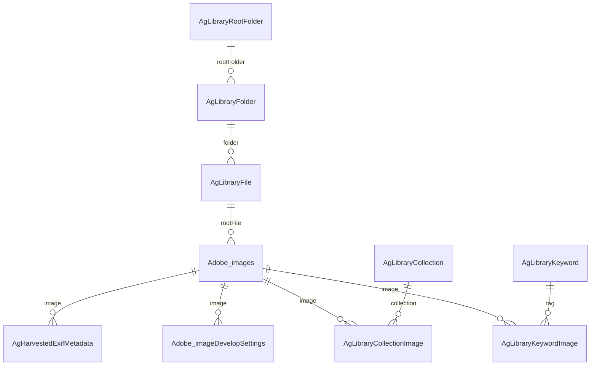

# Lightroom Classic Catalog Schema (.lrcat)

Lightroom Classic stores its catalog as a SQLite database. This document describes the schema as discovered from a real v13.3 catalog.

## Core Tables & Relationships



## File Location Chain

The path to any image on disk is reconstructed by joining three tables:

```
AgLibraryRootFolder.absolutePath + AgLibraryFolder.pathFromRoot + AgLibraryFile.baseName + '.' + AgLibraryFile.extension
```

Example:
```
/Volumes/Photo Drive/Photos/ + 2024/January/ + IMG_1234 + .CR3
→ /Volumes/Photo Drive/Photos/2024/January/IMG_1234.CR3
```

---

## Table Reference

### Adobe_images (main image record)

| Column | Type | Description |
|--------|------|-------------|
| `id_local` | INTEGER PK | Unique image ID across the catalog |
| `id_global` | TEXT UNIQUE | UUID for the image |
| `rootFile` | INTEGER FK | → `AgLibraryFile.id_local` |
| `captureTime` | TEXT | Capture timestamp |
| `rating` | INTEGER | Star rating (0-5) |
| `pick` | INTEGER | Flag status (0=unflagged, 1=picked, -1=rejected) |
| `colorLabels` | TEXT | Color label name |
| `orientation` | TEXT | EXIF orientation |
| `fileFormat` | TEXT | e.g. `RAW`, `JPG`, `DNG` |
| `fileHeight` / `fileWidth` | REAL | Pixel dimensions |
| `masterImage` | INTEGER | FK to master if this is a virtual copy |
| `copyName` | TEXT | Virtual copy name |
| `developSettingsIDCache` | TEXT | Cached develop settings reference |

### AgLibraryFile (file records)

| Column | Type | Description |
|--------|------|-------------|
| `id_local` | INTEGER PK | |
| `baseName` | TEXT | Filename without extension |
| `extension` | TEXT | File extension (e.g. `CR3`, `JPG`) |
| `folder` | INTEGER FK | → `AgLibraryFolder.id_local` |
| `originalFilename` | TEXT | Original filename at import |
| `md5` | TEXT | File hash |

### AgLibraryFolder (folders)

| Column | Type | Description |
|--------|------|-------------|
| `id_local` | INTEGER PK | |
| `pathFromRoot` | TEXT | Relative path from root folder |
| `rootFolder` | INTEGER FK | → `AgLibraryRootFolder.id_local` |
| `parentId` | INTEGER FK | Self-referencing parent folder |

### AgLibraryRootFolder (volume mount points)

| Column | Type | Description |
|--------|------|-------------|
| `id_local` | INTEGER PK | |
| `absolutePath` | TEXT | e.g. `/Volumes/Photo Drive/Photos/` |
| `name` | TEXT | Display name |

### AgLibraryKeyword (keywords/tags)

| Column | Description |
|--------|-------------|
| `id_local` | PK |
| `name` | Keyword text |
| `lc_name` | Lowercase keyword |
| `parent` | FK → self (hierarchical keywords) |

### AgLibraryKeywordImage (keyword ↔ image join)

| Column | Description |
|--------|-------------|
| `image` | FK → `Adobe_images.id_local` |
| `tag` | FK → `AgLibraryKeyword.id_local` |

### AgLibraryCollection (collections/albums)

| Column | Description |
|--------|-------------|
| `id_local` | PK |
| `name` | Collection name |
| `parent` | FK → self |

### AgHarvestedExifMetadata (EXIF data)

| Column | Description |
|--------|-------------|
| `image` | FK → `Adobe_images.id_local` |
| `aperture` | f-stop value |
| `shutterSpeed` | Shutter speed |
| `isoSpeedRating` | ISO value |
| `focalLength` | Focal length in mm |
| `gpsLatitude` / `gpsLongitude` | GPS coordinates |
| `cameraModelRef` | FK → `AgInternedExifCameraModel` |
| `lensRef` | FK → `AgInternedExifLens` |

---

## Useful Queries

### Get all images with full paths
```sql
SELECT 
    img.id_local AS image_id,
    root.absolutePath || folder.pathFromRoot || file.baseName || '.' || file.extension AS full_path,
    img.captureTime,
    img.rating
FROM Adobe_images img
JOIN AgLibraryFile file ON img.rootFile = file.id_local
JOIN AgLibraryFolder folder ON file.folder = folder.id_local
JOIN AgLibraryRootFolder root ON folder.rootFolder = root.id_local
ORDER BY img.captureTime DESC;
```

### Get file format distribution
```sql
SELECT LOWER(file.extension) AS ext, COUNT(*) AS count 
FROM AgLibraryFile file 
GROUP BY LOWER(file.extension) 
ORDER BY count DESC;
```

### Get all keywords for an image
```sql
SELECT kw.name 
FROM AgLibraryKeyword kw
JOIN AgLibraryKeywordImage ki ON kw.id_local = ki.tag
WHERE ki.image = ?;
```

## Total Tables

The catalog contains **130+ tables**. The ones listed above are the most commonly used. Other notable table groups include:

- `Adobe_imageDevelopSettings` — Develop module settings (white balance, exposure, etc.)
- `AgLibraryFace*` — Face detection and recognition data
- `AgLibraryImport*` — Import history
- `AgLibraryPublishedCollection*` — Publish service data
- `AgOz*` / `AgPendingOz*` — Cloud sync (Adobe Creative Cloud)
- `AgVideoInfo` — Video file metadata
